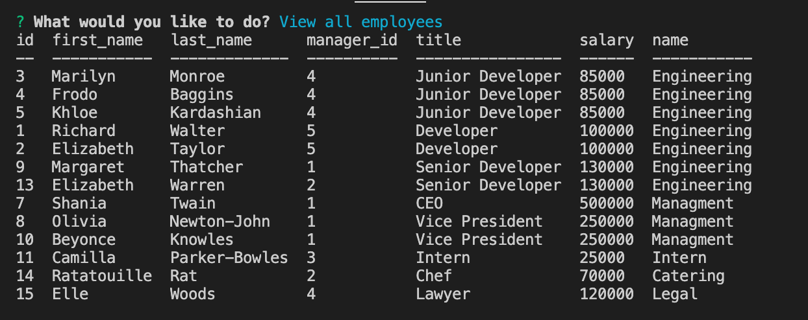
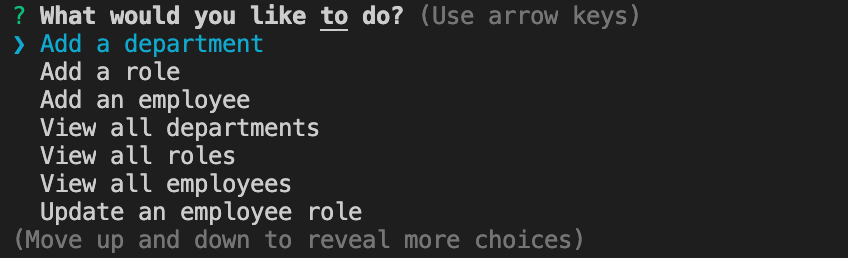

# employeeTracker

## Table of Contents
  1. [Description](#description)
  2. [Image of product](#screenshots)
  3. [Usage](#usage)
  4. [Questions](#questions)
  
  
  
## Description 
This application is designed to make managing a roster of employees easy by gathering information via inquirer in node.js and using the data to update an employee database housed in MySQL.  There are three tables of information: employees, roles, and departments, each connecting to the other at certain data points.  When you view all employees, you will see each piece of relevant data, even though they are not all on the Employee table.  Through the interface the user can update employees' roles, delete employees, add and view employees, roles, and departments.

## Image of product 

## Usage 
To use, simply answer the questions promted when node runs "index.js".

Watch a video of the app in use [here](https://drive.google.com/file/d/1bv6F1Q5TpKO2XKmJo-Y55ja-LmNMgz_w/view).

## Questions 
If you have any questions, you may reach out to me at richardwalter515@gmail.com
or visit me on [GitHub](https://www.github.com/richardwalter515)